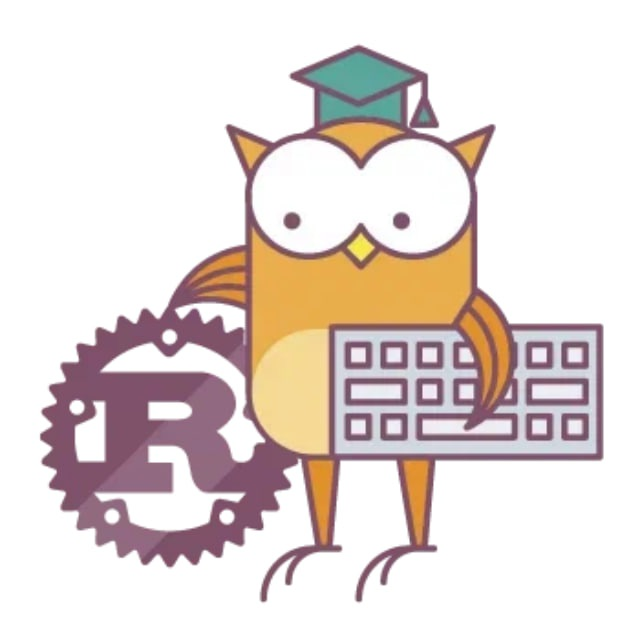

<h1 style="text-align: center;"> 
<a href="https://otus.ru/lessons/rust-developer-basic/">Rust Developer. Basic</a>
</h1>

[//]: # (![]&#40;./docs/img.png =250x&#41;)

---

Домашние задания

1. [ Чиним, собираем и запускаем приложение](./docs/hw1.md)
2. [ Реализация функции](./docs/hw2.md)
3. [ Работа с кодом](./docs/hw3.md)
4. [ Заимствование](./docs/hw4.md)
5. [ Процедурный/объективный код](./docs/hw5.md)
6. [ Работа с кодом: дублирование кода](./docs/hw6.md)
7. [ Компилятор](./docs/hw7.md)
8. [ Макросы](./docs/hw8.md)

Практика

* [Практика написания кода](./docs/PROBLEMS.md)
* [Практика на владение и заимствование](./docs/Practice_1.md)

